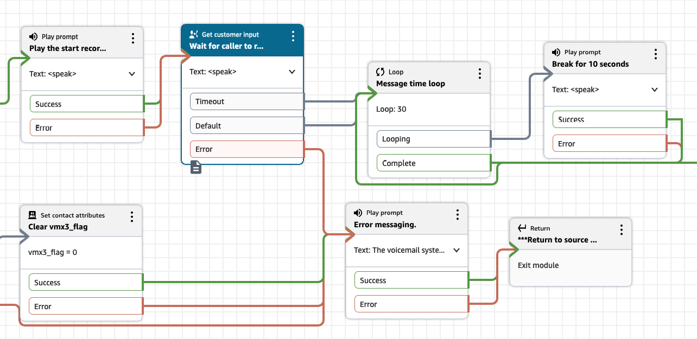

# Handling voicemails longer than 25 minutes
Voicemail express has been validated at scale with messages up to 5 minutes long. This will cover the majority of use cases. If, however, you need to support longer voicemails, there are two considerations:
1.  How much memory the Recording Processor Lambda function needs to process the message and
1.  How much time it takes to do it

For the default deployment, the Recording Process function is configured with 512 MB of memory and a 15 minute timeout. With the new recording configuration, Lambda function timeout should not be a concern here, as the function can comfortably handle nearly 4 hours of audio processing time. The issue is more around the memory assigned to the function. The default Lambda memory is 128 MB, which was insufficient for a 5 minute message, so it was moved up to 512 (the next pricing tier limit). At 512, it should be able to comfortably handle up to 25 minutes of audio, however this has not been validated at scale. 

## How do I know if my function is running out of memory?
If your voicemail never makes it past the Recording Processor function, check the Cloudwatch logs. You will likely see an entry similar to this:
```
{
    "time": "2024-12-30T23:20:29.823Z",
    "type": "platform.report",
    "record": {
        "requestId": "671dc475-78c6-416b-b7ac-56b52940dd13",
        "metrics": {
            "durationMs": 32973.233,
            "billedDurationMs": 32974,
            "memorySizeMB": 128,
            "maxMemoryUsedMB": 125
        },
        "status": "error",
        "errorType": "Runtime.OutOfMemory"
    }
}
```
This indicates that you do not have enough memory on your function to complete the audio processing. Increase the amount of memory assigned to your function and re-test. 

# Configuring your flow module to accomodate longer messages
In the standard VMX module, the maximum amount of time you can allow for voicemail messages is 180 seconds. That is the max timeout for a Get customer input block. If you want to extend that longer, you will need to hold the call in the flow using a number of different approaches. The most simple approach is to create a loop with a play prompt insite. Using SSML, you can create a prompt that just waits for up to 10 seconds. Then simply loop until you have hit your maximum time, which would be 100 loops of 10 seconds, or 16 minutes and 40 seconds. Combined with the 180 seconds of time in your Get customer input block, that provides up to 19 minutes and 40 seconds. Below is a screenshot of this sort of configuration, showing a flow with 3 minutes of Get customer input time + 5 minutes of loop time, for 8 minutes of recording time total:
