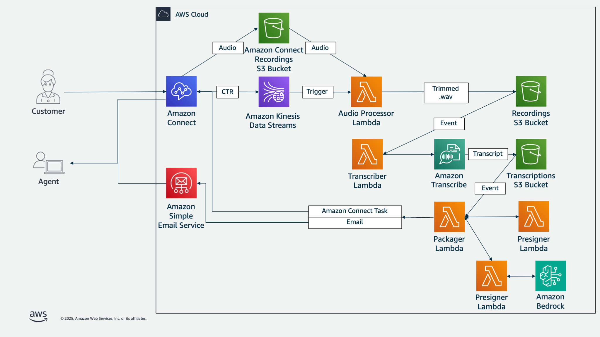

# Voicemail Express V3
Voicemail Express is designed to provide basic voicemail functionality to Amazon Connect. It has been designed to work seamlessly behind the scenes, providing voicemail options for all agents and queues by default. It is an evolution of the Voicemail Express solution that was created specifically for Service Cloud Voice customers by the AWS team that worked with Salesforce to develop Service Cloud Voice. That solution has been cloned and included with Service Cloud Voice, and is now used at scale by customers on that offering. This version removes the Salesforce-centric options, providing the same easy-to-deploy-and-use voicemail option for standard Amazon Connect customers. Typically speaking, Voicemail Express can be deployed and validated in less than 15 minutes. 

## What's new in VMX3 (2025.09.12)
-  **New Features**
   -  Uses Amazon Connect's built-in IVR recording option to reduce complexity, increase compatability, and remove KVS for all deployments
   -  Deployment option for GovCloud Implementations
   -  Changes agent voicemail from using personal queues to preferred-agent routing to eliminate over-prioritization of voicemails
   -  Added option for generative AI summary of voicemail (not currently available for Canada or South Africa)
-  **Security Enhancements**: 
   -  Support for bucket versioning
-  **Performance Validation**:
   -  Validated functionality for voicemails up to 25 minutes long
-  **Example Flows**:
   -  Sample queue flow demonstrating how to cleanly do an uninterruptable voicemail while in a queue flow
   -  Sample agent whisper flow which removes the voicemail flag when an agent is connected to a caller who was leaving a voicemail
-  **Documentation Updates**: 
   -  Documented changes needed to support voicemail messages >5 minutes
   -  Documented configuration allowing for voicemail self-service
   -  Documented configuration for in-queue voicemails
-  **Fixes:**
   -  Truncating voicemail transcripts longer than 4096 bytes (Field limit in tasks)
   -  Additional filtering for better performance in high volume environments
   -  Updated keys for recordings and transcripts to make files easier to find
   -  Updated all functions to Python 3.13
   -  Updated logging and error handling in functions
   -  Updated view for agent guide

## How it works
With Voicemail Express, customers can have the option to leave a voicemail for an individual agent or an Amazon Connect Queue. Once the voicemail is recorded, a series of processes take place in the following order:
1. Voicemail recording is extracted and stored in S3 as a .wav file
1. The recording is transcribed using Amazon Transcribe
1. (If necessary) A presigned URL is generated that provides access to the voicemail recording without the need for further authentication
1. The voicemail is packaged for delivery, including the transcription, optional generative AI summary, presigned URL, and contact data. It is then delivered as an Amazon Connect Task, Guided Task, or via email using Amazon Simple Email Service (SES), depending on your configuration.

Voicemail presigned URLs are configured for a maximum length of 7 days. After 7 days, the presigned URL is no longer valid. A seperate timeframe is configured for the recordings, which are lifecycled as desired once that timeframe is met. During deployment, you have the option to configure the lifecycle window, if desired. Additionally, you have the option to keep, archive, or delete voicemail recordings. 

## Deployment and Management
### How to deploy
To deploy Voicemail Express, you will need to complete the following:
1. Complete the [Voicemail Express Prerequisites](Docs/vmx_prerequistes.md)
1. Complete the [Voicemail Express Installation](Docs/vmx_installation_instructions.md)

### How to upgrade
To upgrade Voicemail Express, follow the [Upgrade Your Installation](Docs/vmx_upgrade.md) instructions.

### How to uninstall
To remove Voicemail Express follow the instructions below:
1.  [Removing/Uninstalling Voicemail Express](Docs/vmx_uninstall.md)

## Using Voicemail Express
Once Voicemail Express has been deployed, you can learn more about it by reading the [High-level overview of the Voicemail Express solution](Docs/vmx_core.md). 

If your primary delivery model is Amazon Connect Guided Tasks, you can learn more about that model [here](Docs/vmx_guided_tasks.md). (This is the default)

If your primary delivery model is Amazon Connect Tasks, you can learn more about that model [here](Docs/vmx_tasks.md). 

If your deployment model is email, you can learn more about that model [here](Docs/vmx_email.md).

Basic troubleshooting steps can be found on the [Troubleshooting Common Voicemail Issues](Docs/vmx_troubleshooting.md) page.

You can also read about the available [support options](Docs/vmx_support.md).

Finally, a list of recent changes be found on the [Changelog](Docs/vmx_changelog.md) page.

## Roadmap
The following items are currently planned for future releases. Changes to roadmap depend on feedback, however one overarching tenet of Voicemail Express is to keep the solution lightweight, with a minimal number of required services and administration, and to replace functionality with native Amazon Connect features as soon as they become available. 

-  Reduce dependence on services external to Amazon Connect
-  

## Current Published Version
### 2025.09.12
This is the published version of the code and templates that has been deployed to our S3 buckets and will be used during a normal deployment.

## Acknowledgements
While the code and documentation has been predominantly pushed by [Jason Douglas](https://github.com/dougjaso), this is largely due to internal team processes. This version of Voicemail Express 3 has been built and tested by a number of people including:

-  [Jason Douglas](https://github.com/dougjaso): Base solution design, roadmap, feature management, brute force Python developer, nitpicker.
-  [Steve Earl](https://github.com/SteveEarl-AWS): (Converted) Python code developer, (Formerly) NodeJS code developer, KVS processing magician, remodeler of cabins.
-  [Rob Pittfield](https://github.com/robpittfield2): Load testing mastermind, community relations, professional-grade sanity checker, herder of cats.